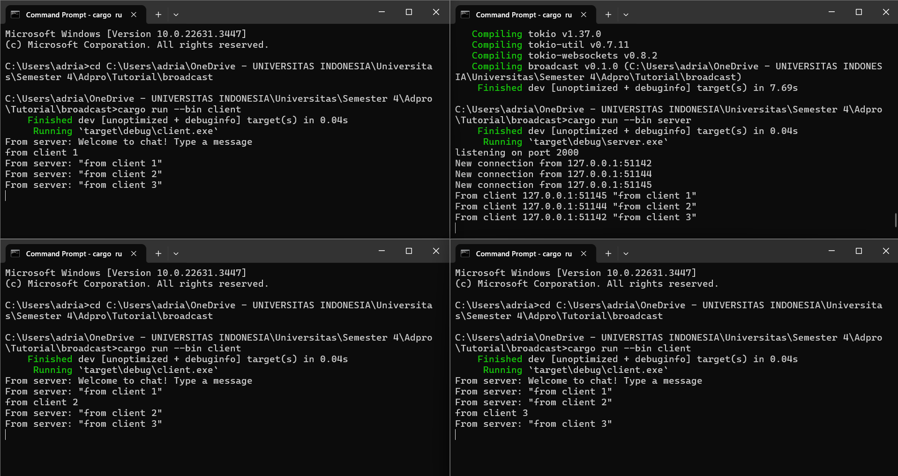
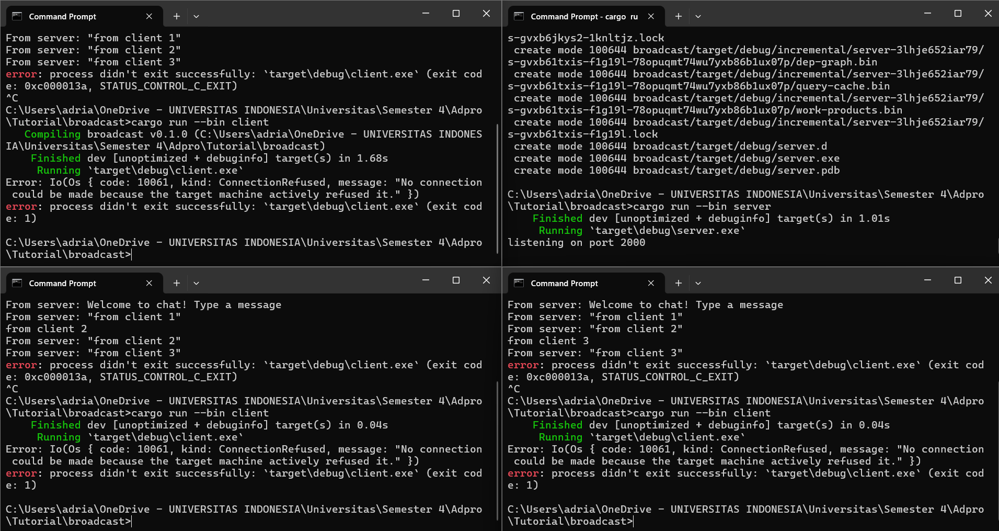
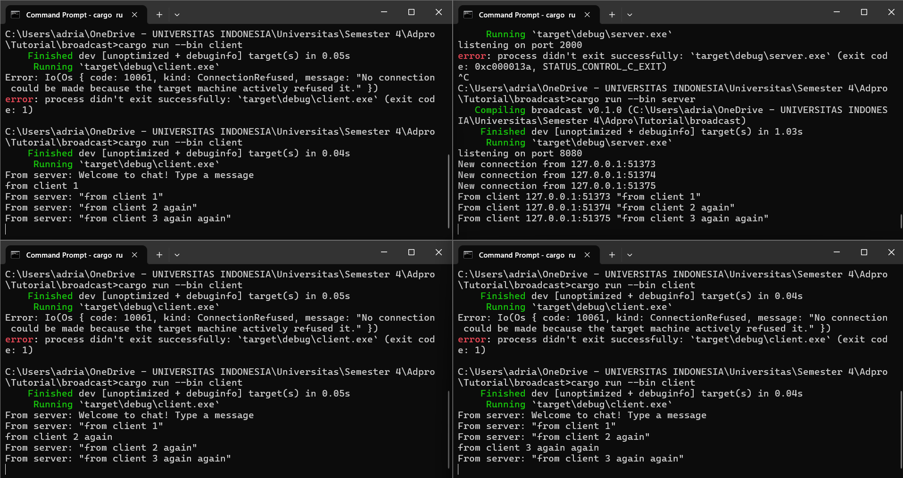

## Latihan 2.1 

After the server is started with the command "cargo run --bin server" and each client is started with the command "cargo run --bin client", the output shows that each client, as well as the server, receives broadcast messages from each client. Every time a client types a message in the command line, that string is sent to the server, and the server then forwards it to all connected clients.

## Latihan 2.2
If we change only one of the ports, for example, the client port, an error will occur on the client side. The client believes that the port does not have a connection, and the program will crash when the “cargo run --bin client” command is executed, as shown in the image below.

However, when both the client and server have the same port, the application will run smoothly, just as before. This can be seen in the image below.

